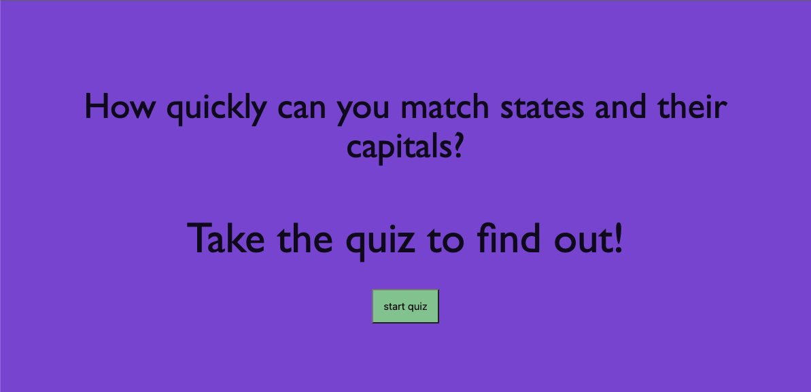

# javascriptQuiz

## Description
This test quizzes your knowledge of states and capitals in a timed quiz brought to you by javascript!

## Table of Contents
    * [Description](#Description)
    * [Installation](#Installation)
    * [Demo](#Demo)
    * [Links](#Links)
    * [License](#License)
    * [Questions](#questions)
   

## Installation
No install required; just visit the link!

## Demo

## Links
(https://kheeb.github.io/javascriptQuiz/)

## License
  MIT is the chosen license for this project.
  * https://opensource.org/licenses/MIT
  * 

## Questions
  Check out my GitHub at https://github.com/kheeb
  Email me with any questions!
  karaheeb@gmail.com
